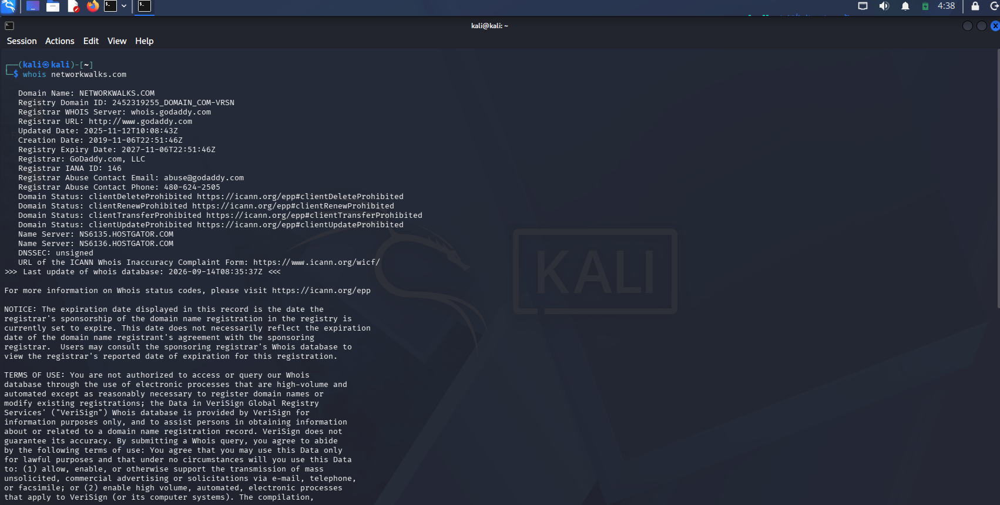
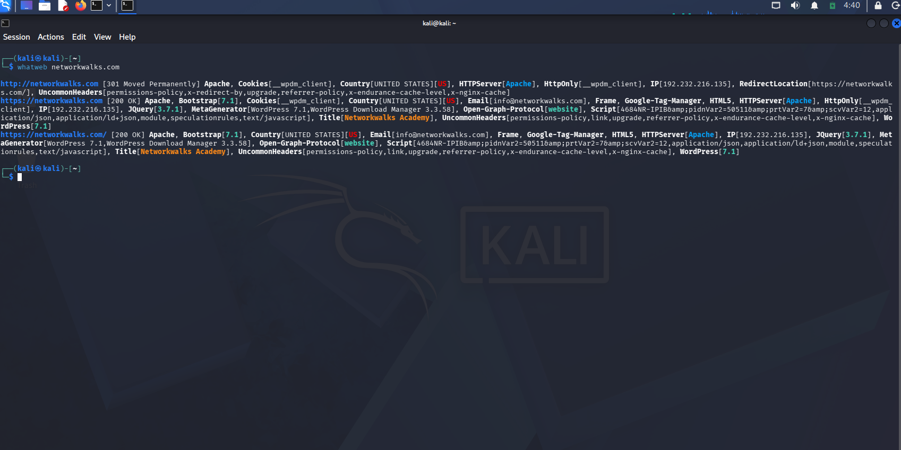
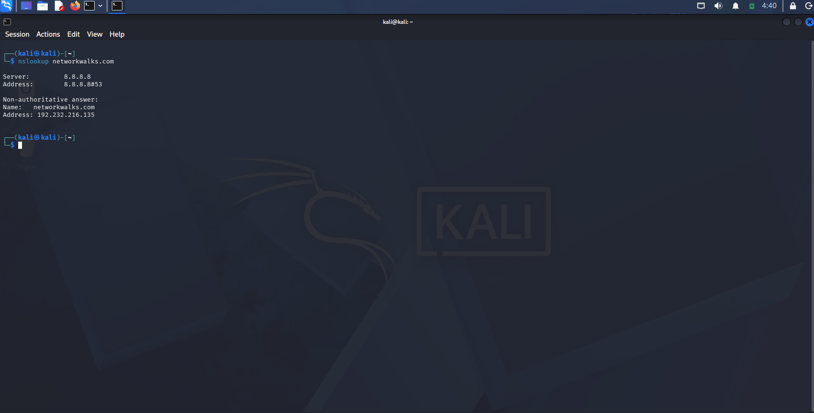
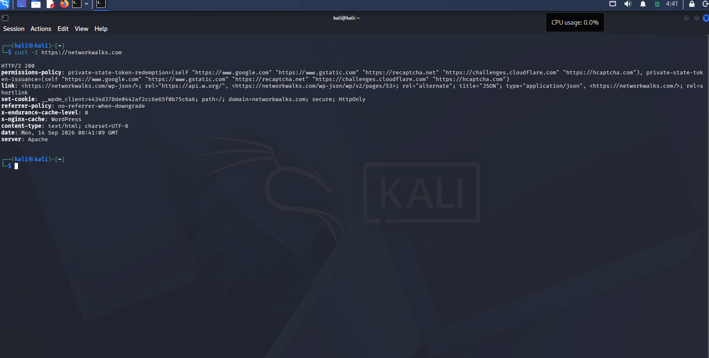
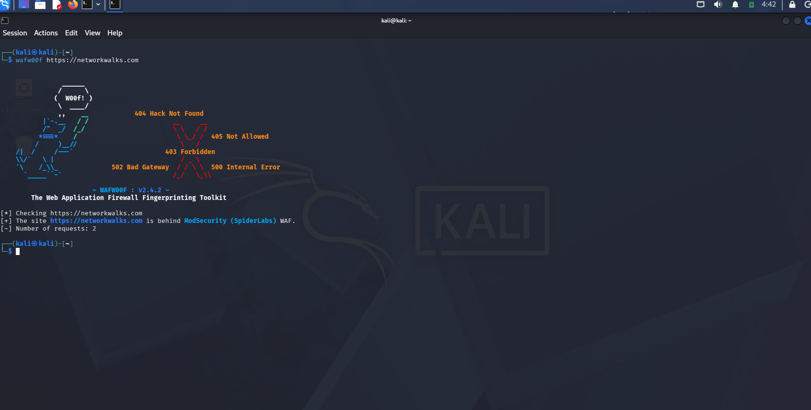
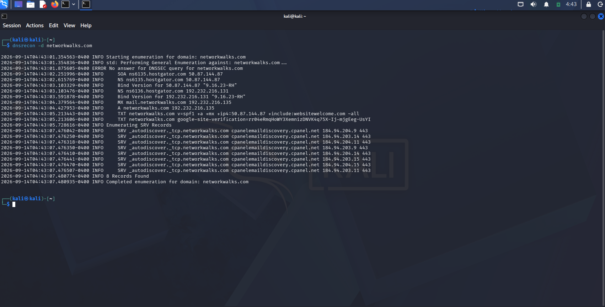

# 🔍 W2-PM1 — Kali Linux Footprinting

### Networkwalks Cybersecurity Internship — Batch B082 | Week 2

> **Phase 1:** Reconnaissance & Footprinting

---

# 📌 Project Overview

As part of Week 2 of my Networkwalks Cybersecurity Internship, I worked on **W2-PM1 — Kali Linux Footprinting**.

In this module, I practiced the initial reconnaissance phase of a penetration test by using different Kali Linux tools to collect information about the authorized target **networkwalks.com**.

The main focus was to understand what information can be identified before moving toward vulnerability assessment or exploitation.

During the exercise, I looked at:

- 🔎 Domain registration information
- 🌐 Web technologies
- 📡 Target IP address
- 📋 HTTP response headers
- 🛡️ Web Application Firewall (WAF)
- 🗂️ DNS records and infrastructure

All activities were performed within the authorized educational scope.

---

# 🎯 Project Objectives

The main objectives of this module were to:

- Understand the reconnaissance and footprinting phase.
- Learn how to collect publicly available information about a target.
- Identify the technologies used by a website.
- Find the IP address associated with a domain.
- Analyze HTTP response headers.
- Identify whether a WAF is being used.
- Enumerate DNS records.
- Understand how this information can help during further security testing.
- Document the results with proper screenshots and observations.

---

# 🧰 Tools & Technologies

| Category | Tool | Purpose |
|---|---|---|
| 🐉 Security OS | Kali Linux | Used as the reconnaissance environment |
| 🔎 Domain Reconnaissance | `WHOIS` | Collect domain registration information |
| 🌐 Web Fingerprinting | `WhatWeb` | Identify web technologies |
| 📡 DNS Resolution | `nslookup` | Resolve domain and IP information |
| 📋 HTTP Analysis | `curl -I` | Check HTTP response headers |
| 🛡️ WAF Detection | `Wafw00f` | Detect Web Application Firewall |
| 🗂️ DNS Enumeration | `DNSRecon` | Enumerate DNS records |

---

# 🎯 Target Information

| Field | Details |
|---|---|
| Target Domain | `networkwalks.com` |
| Assessment Type | Footprinting & Reconnaissance |
| Phase | Phase 1 — Reconnaissance & Footprinting |
| Environment | Kali Linux |
| Scope | Authorized educational assessment |
| Module | W2-PM1 — Multiple Kali Tools |

---

# 🧭 Methodology

I followed a simple reconnaissance workflow during this module:

```text
                    TARGET
                       │
                       ▼
              ┌─────────────────┐
              │      WHOIS      │
              │ Domain Details  │
              └────────┬────────┘
                       │
                       ▼
              ┌─────────────────┐
              │     WhatWeb     │
              │ Web Technologies│
              └────────┬────────┘
                       │
                       ▼
              ┌─────────────────┐
              │    nslookup     │
              │     DNS / IP    │
              └────────┬────────┘
                       │
                       ▼
              ┌─────────────────┐
              │     curl -I     │
              │  HTTP Headers   │
              └────────┬────────┘
                       │
                       ▼
              ┌─────────────────┐
              │    Wafw00f      │
              │  WAF Detection  │
              └────────┬────────┘
                       │
                       ▼
              ┌─────────────────┐
              │    DNSRecon     │
              │   DNS Records   │
              └────────┬────────┘
                       │
                       ▼
              ┌─────────────────┐
              │    Findings     │
              │  & Risk Review  │
              └─────────────────┘
```

---

# 🔎 Activities Performed

## 1️⃣ WHOIS Enumeration

### 🎯 What I Did

I started the reconnaissance by using **WHOIS** to collect publicly available registration information about the target domain.

### 🛠️ Tool Used

```text
WHOIS
```

### 💻 Command

```bash
whois networkwalks.com
```

### 🔍 Result

From the WHOIS information, I identified:

```text
Registrar: GoDaddy
```

The WHOIS lookup provided publicly available information related to the registration of the domain.

### 💡 What I Learned

WHOIS information can help in understanding who manages or is associated with a domain.

From a security perspective, this information can be useful during the initial reconnaissance phase when building a profile of the target.

### 📸 Screenshot

**SS 01 — WHOIS Domain Information**



---

## 2️⃣ Web Technology Fingerprinting — WhatWeb

### 🎯 What I Did

Next, I used **WhatWeb** to identify the technologies being used by the target website.

### 🛠️ Tool Used

```text
WhatWeb
```

### 💻 Command

```bash
whatweb networkwalks.com
```

### 🔍 Result

The scan identified the following information:

| Technology | Result |
|---|---|
| CMS | WordPress 7.0.4 |
| Plugin | WP Download Manager 3.3.58 |
| Web Server | Apache |
| IP Address | `192.232.216.135` |

### 💡 What I Learned

WhatWeb is useful for quickly understanding the technology stack behind a website.

Knowing the CMS, plugins, and server technologies can help a security tester decide what should be investigated further during an authorized assessment.

> **Note:** Finding a technology or version does not by itself mean that the target is vulnerable.

### 📸 Screenshot

**SS 02 — WhatWeb Web Technology Fingerprinting**



---

## 3️⃣ DNS Resolution — nslookup

### 🎯 What I Did

I then used **nslookup** to resolve the target domain and check the IP address associated with it.

### 🛠️ Tool Used

```text
nslookup
```

### 💻 Command

```bash
nslookup networkwalks.com
```

### 🔍 Result

The target domain resolved to:

```text
192.232.216.135
```

### 💡 What I Learned

DNS resolution is one of the basic steps in reconnaissance.

Finding the IP address gives a tester more information about the infrastructure associated with the domain and can be useful for further authorized testing.

### 📸 Screenshot

**SS 03 — DNS Resolution**



---

## 4️⃣ HTTP Header Analysis — curl

### 🎯 What I Did

After resolving the target, I used **curl** to check the HTTP response headers returned by the website.

### 🛠️ Tool Used

```text
curl
```

### 💻 Command

```bash
curl -I https://networkwalks.com
```

### 🔍 Result

The command returned the HTTP response headers from the target.

I reviewed the response for technical information that was being exposed by the web server.

### 💡 What I Learned

HTTP headers can sometimes provide useful information about the web server and application environment.

During a penetration test, this information can help in understanding the technologies and configuration of the target.

### 📸 Screenshot

**SS 04 — HTTP Response Headers**



---

## 5️⃣ WAF Detection — Wafw00f

### 🎯 What I Did

I used **Wafw00f** to check whether a Web Application Firewall was being used by the target.

### 🛠️ Tool Used

```text
Wafw00f
```

### 💻 Command

```bash
wafw00f https://networkwalks.com
```

### 🔍 Result

The tool identified:

```text
ModSecurity (SpiderLabs)
```

as the detected Web Application Firewall.

### 💡 What I Learned

Wafw00f can help identify the WAF technology protecting a web application.

Knowing that a WAF is present gives a tester an idea about the defensive controls around the application.

> **Note:** Identifying a WAF is only a reconnaissance observation and is not a confirmed vulnerability.

### 📸 Screenshot

**SS 05 — WAF Detection**



---

## 6️⃣ DNS Enumeration — DNSRecon

### 🎯 What I Did

Finally, I used **DNSRecon** to collect and enumerate publicly available DNS information for the target domain.

### 🛠️ Tool Used

```text
DNSRecon
```

### 💻 Command

```bash
dnsrecon -d networkwalks.com
```

### 🔍 Result

The enumeration identified DNS information including:

- MX records
- TXT records
- cPanel-related SRV records
- Mail infrastructure

One of the identified mail-related records was:

```text
mail.networkwalks.com
```

### 💡 What I Learned

DNS enumeration can reveal useful information about the infrastructure associated with a domain.

MX, TXT, and SRV records can provide information about mail services and other services connected to the organization's domain.

### 📸 Screenshot

**SS 06 — DNSRecon Enumeration**


---

# 📊 Findings Summary

After completing the six reconnaissance activities, I identified the following observations:

| No. | Finding | Risk |
|---:|---|---|
| 1 | Web technology and version information exposed | 🟠 Medium |
| 2 | WAF technology identifiable | 🟢 Low |
| 3 | DNS infrastructure information exposed | 🟠 Medium |

> ⚠️ These are reconnaissance observations and potential security considerations. They are not being treated as confirmed vulnerabilities without further authorized validation.

---

# ⚠️ Risk & Security Impact

## 🟠 Finding 01 — Web Technology Information Exposure

### Observation

The target's web technology stack was identified as:

- WordPress 7.0.4
- WP Download Manager 3.3.58
- Apache

### Potential Impact

An attacker could use publicly available technology and version information to identify software that may need further security investigation.

### Risk Level

**Medium**

### Recommendation

Regularly review publicly exposed technologies and keep CMS components, plugins, and server software updated.

---

## 🟢 Finding 02 — WAF Technology Disclosure

### Observation

Wafw00f identified:

```text
ModSecurity (SpiderLabs)
```

### Potential Impact

This provides information about the security technology being used to protect the web application.

### Risk Level

**Low**

### Recommendation

Keep the WAF properly configured, updated, monitored, and tuned.

---

## 🟠 Finding 03 — DNS Infrastructure Exposure

### Observation

DNSRecon identified information including MX, TXT, and cPanel-related SRV records.

### Potential Impact

This information can help someone build a better understanding of the organization's external infrastructure.

### Risk Level

**Medium**

### Recommendation

Regularly review DNS records and remove unnecessary or outdated records and services.

---

# 📈 Overall Risk Assessment

| Risk Area | Risk Level |
|---|---|
| Web Technology Exposure | 🟠 Medium |
| WAF Technology Disclosure | 🟢 Low |
| DNS Infrastructure Exposure | 🟠 Medium |
| **Overall Reconnaissance Risk** | **🟠 Medium** |

The findings from this module mainly relate to **information exposure during reconnaissance**.

No confirmed exploitation is claimed in this module.

---

# 🛡️ Recommendations

## 🌐 Web Application

- Keep WordPress updated.
- Keep installed plugins updated.
- Review publicly exposed technology and version information.
- Review HTTP response headers.
- Avoid unnecessary technical information disclosure.

## 🛡️ WAF

- Keep ModSecurity enabled.
- Keep WAF rules updated.
- Monitor WAF logs and alerts.
- Regularly review and tune WAF configuration.

## 🗂️ DNS

- Review DNS records regularly.
- Remove outdated records.
- Remove unnecessary publicly exposed services.
- Review MX, TXT, and SRV records.
- Monitor changes to external DNS infrastructure.

## 🔎 External Attack Surface

- Perform regular authorized reconnaissance.
- Maintain an inventory of externally exposed assets.
- Monitor domains, subdomains, technologies, and services.
- Review the public attack surface from an attacker's perspective.

---

# 🧠 Key Learning Outcomes

During this module, I learned how different reconnaissance tools can be combined to build an initial picture of a target.

I gained practical experience with:

- 🔎 WHOIS enumeration
- 🌐 Web technology fingerprinting
- 📡 DNS resolution
- 📋 HTTP header analysis
- 🛡️ WAF detection
- 🗂️ DNS enumeration
- 📊 Reconnaissance documentation
- ⚠️ Basic risk analysis

One of the main things I learned from this exercise is that a lot of useful information can be collected **before attempting any vulnerability exploitation**.

---

# 🔄 Reconnaissance Workflow

```text
WHOIS
  │
  ▼
Domain Registration Information
  │
  ▼
WhatWeb
  │
  ▼
Web Technology Fingerprinting
  │
  ▼
nslookup
  │
  ▼
DNS / IP Resolution
  │
  ▼
curl -I
  │
  ▼
HTTP Header Analysis
  │
  ▼
Wafw00f
  │
  ▼
WAF Identification
  │
  ▼
DNSRecon
  │
  ▼
DNS Enumeration
  │
  ▼
Findings & Risk Analysis
```

---

# 📸 Evidence & Screenshots

All screenshots for this module are stored inside the `screenshots/` directory.

## Evidence 1 — WHOIS Domain Information


---

## Evidence 2 — WhatWeb Web Technology Fingerprinting


)

---

## Evidence 3 — nslookup DNS Resolution


)

---

## Evidence 4 — curl HTTP Header Analysis


)

---

## Evidence 5 — Wafw00f WAF Detection


)

---

## Evidence 6 — DNSRecon DNS Enumeration


---

# 📁 Repository Structure

```text
W2 PM1 - Kali Linux Footprinting/
│
├── README.md
│
└── screenshots/
    │
    ├── 01-whois.png
    ├── 02-whatweb.png
    ├── 03-nslookup.png
    ├── 04-curl.png
    ├── 05-wafw00f.png
    └── 06-dnsrecon.png
```

---

# 📋 Module Summary

| Category | Details |
|---|---|
| Module | W2-PM1 |
| Phase | Reconnaissance & Footprinting |
| Target | `networkwalks.com` |
| Platform | Kali Linux |
| Tools | WHOIS, WhatWeb, nslookup, curl, Wafw00f, DNSRecon |
| Web Technology | WordPress 7.0.4 |
| Plugin | WP Download Manager 3.3.58 |
| Web Server | Apache |
| Target IP | `192.232.216.135` |
| WAF | ModSecurity (SpiderLabs) |
| DNS Information | MX, TXT, SRV and related records |

---

# ⚖️ Legal & Ethical Disclaimer

All activities documented in this module were performed within an **authorized educational scope**.

The techniques and tools demonstrated in this project are intended for:

- 🎓 Cybersecurity education
- 🔬 Security research
- 🧪 Authorized penetration testing
- 🛡️ Defensive security learning
- 🧑‍💻 Controlled laboratory environments

> ⚠️ **Never use these tools, commands, or techniques against systems or networks without explicit authorization.**

Unauthorized reconnaissance, scanning, exploitation, or access may violate applicable laws, organizational policies, and terms of service.

I am responsible for ensuring that all security activities remain within the approved scope.

---

# 📚 Project Information

| Field | Details |
|---|---|
| 🎓 Program | Networkwalks Cybersecurity Internship |
| 👨‍💻 Batch | B082 |
| 📅 Week | 02 |
| 🔍 Module | W2-PM1 |
| 🛡️ Phase | Reconnaissance & Footprinting |
| 🐉 Platform | Kali Linux |
| 🎯 Target | `networkwalks.com` |
| 📌 Assessment Type | Footprinting & Reconnaissance |

---

# 👤 Author

**Gopal Mahajan**

### 🔐 Cybersecurity Journey

> **Reconnaissance → Footprinting → Enumeration → Risk Analysis → Professional Reporting**

**🔐 Learn responsibly. Test ethically. Document professionally.**

---

# ⭐ Acknowledgement

This module was completed as part of the **Networkwalks Cybersecurity Internship Program — Batch B082**.

This exercise helped me gain practical experience with reconnaissance tools and understand how information gathering forms the foundation of a penetration-testing workflow.

---

# 🚀 W2-PM1 Completed

```text
WHOIS
  ↓
WhatWeb
  ↓
nslookup
  ↓
curl
  ↓
Wafw00f
  ↓
DNSRecon
  ↓
Findings
  ↓
Risk Analysis
  ↓
Recommendations
```

**🔐 Learn responsibly. Test ethically. Document professionally.**
