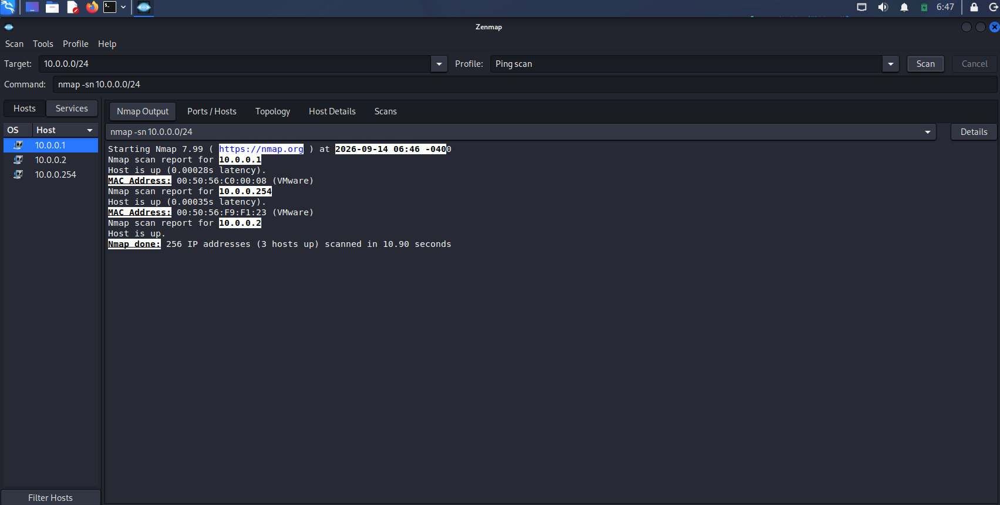
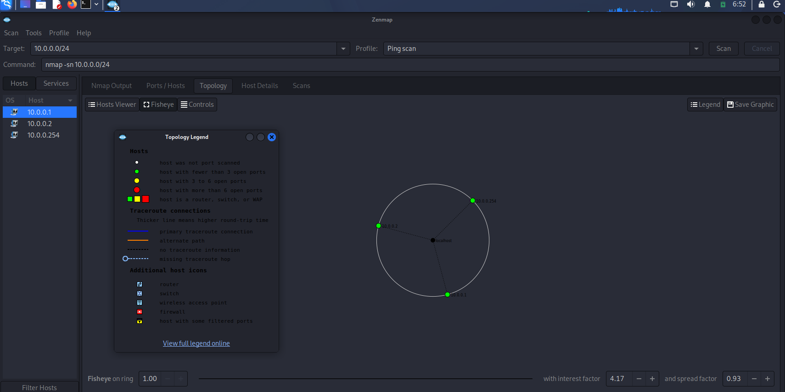

# 🖥️ W2-PM5 — Zenmap Local Network Scanning

**Networkwalks Cybersecurity Internship — Batch B083 | Week 2**

> **Phase 2: Scanning & Network Discovery**

---

# 📌 Project Overview

This module focuses on **local network discovery and scanning** using **Zenmap**, the graphical interface for Nmap.

The objective was to identify active hosts within the local network and visualize the discovered network topology.

The scan was performed against:

```text
10.0.0.0/24
```

The activity identified active hosts on the local virtual network.

---

# 🎯 Objectives

The main objectives of this module were:

- Understand the purpose of network discovery.
- Learn how to use Zenmap for network scanning.
- Identify active hosts on a local network.
- Understand the Ping Scan profile.
- Review Nmap scan results through Zenmap.
- Visualize discovered hosts using network topology.
- Understand how network discovery contributes to penetration testing.

---

# 🛠️ Tool Used

## Zenmap

### Purpose

Zenmap is the graphical user interface for Nmap.

It provides a visual way to configure scans, execute Nmap commands, review scan results, and visualize network topology.

### Main Uses

- Host discovery
- Port scanning
- Network mapping
- Service enumeration
- Scan result analysis
- Network topology visualization

---

# 🎯 Target Information

### Target Network

```text
10.0.0.0/24
```

### Scan Type

```text
Ping Scan
```

### Nmap Command

```bash
nmap -sn 10.0.0.0/24
```

### Scan Purpose

The scan was used to determine which hosts were active within the local network.

---

# 🔬 Methodology

The following methodology was followed:

```text
Local Network
      ↓
Launch Zenmap
      ↓
Enter Target Network
      ↓
Select Ping Scan
      ↓
Execute Nmap Scan
      ↓
Identify Active Hosts
      ↓
Review Scan Results
      ↓
View Network Topology
      ↓
Document Findings
```

---

# 💻 Activities Performed

## Activity 1 — Zenmap Ping Scan

### Objective

Discover active hosts within the local `10.0.0.0/24` network.

### Target

```text
10.0.0.0/24
```

### Profile

```text
Ping Scan
```

### Command

```bash
nmap -sn 10.0.0.0/24
```

### Result

The scan identified **3 active hosts** within the scanned network:

```text
10.0.0.1
10.0.0.2
10.0.0.3
```

The scan output showed the hosts as up.

The results also displayed MAC address information for the discovered hosts.

The scan was completed successfully and reported:

```text
Nmap done: 256 IP addresses (3 hosts up)
```

### Security Relevance

Host discovery is an important part of network reconnaissance.

Identifying active hosts can help a security tester understand:

- Which systems are currently active.
- The size of the accessible network.
- Potential systems that may require further assessment.
- Network infrastructure and virtualization devices.

### Screenshot Evidence



---

# 🌐 Activity 2 — Network Topology Visualization

### Objective

Visualize the relationship between the local system and the discovered hosts.

### Tool Used

```text
Zenmap Topology
```

### Result

Zenmap displayed a network topology containing:

```text
localhost
10.0.0.1
10.0.0.2
10.0.0.3
```

The topology view provided a graphical representation of the discovered hosts and their relationship with the scanning system.

### Security Relevance

Network topology visualization helps security professionals understand the structure of a network.

It can assist with:

- Network mapping.
- Identifying connected hosts.
- Understanding network relationships.
- Planning further security testing.
- Documenting network infrastructure.

### Screenshot Evidence



---

# 📊 Findings Summary

| Finding | Observation | Security Relevance |
|---|---|---|
| Target Network | `10.0.0.0/24` | Local network selected for discovery |
| Scan Type | Ping Scan | Used to identify active hosts |
| Active Hosts | 3 | Shows systems responding on the network |
| Host 1 | `10.0.0.1` | Active host identified |
| Host 2 | `10.0.0.2` | Active host identified |
| Host 3 | `10.0.0.3` | Active host identified |
| Topology | Hosts visualized in Zenmap | Helps understand network structure |

---

# 🔐 Security Impact

The network discovery activity demonstrated how an attacker or security tester can identify active systems within an accessible network.

### Host Discovery

Three active hosts were identified in the scanned `/24` network.

**Security Consideration: Medium**

Knowing which systems are active can provide useful information for further network assessment.

### Network Visibility

The Zenmap topology view provided a visual representation of the discovered network.

**Security Consideration: Low to Medium**

Network mapping can help identify the structure and relationships of accessible systems.

> These findings represent network reconnaissance observations and are not confirmed vulnerabilities.

---

# 🛡️ Recommendations

For network security, organizations should:

- Maintain an inventory of authorized network devices.
- Segment networks where appropriate.
- Restrict unnecessary network access.
- Use firewalls and access-control rules.
- Monitor unexpected devices on internal networks.
- Regularly review network topology.
- Disable unnecessary services.
- Monitor network discovery and scanning activity.
- Apply appropriate security controls to virtualized environments.

---

# 🧠 Learning Outcomes

After completing this module, I learned:

- The purpose of network discovery.
- How to use Zenmap for host discovery.
- How Ping Scan works at a basic level.
- How to scan a local `/24` network.
- How to identify active hosts.
- How to review Nmap results through Zenmap.
- How to visualize discovered hosts using the topology feature.
- How network discovery fits into a penetration testing workflow.
- How to document network reconnaissance results.

---

# 🔄 Network Scanning Workflow

```text
1. Identify Local Network
        ↓
2. Launch Zenmap
        ↓
3. Enter Target Network
        ↓
4. Select Ping Scan
        ↓
5. Execute Scan
        ↓
6. Identify Active Hosts
        ↓
7. Review Scan Results
        ↓
8. Visualize Network Topology
        ↓
9. Analyze Security Relevance
        ↓
10. Document Findings
```

---

# 📸 Evidence & Screenshots

## Evidence 1 — Zenmap Ping Scan

The screenshot demonstrates the Ping Scan performed against the local `10.0.0.0/24` network and shows the three active hosts identified during the scan.


---

## Evidence 2 — Zenmap Network Topology

The screenshot demonstrates the Zenmap topology view showing the local system and the discovered hosts.


---

# 📁 Repository Structure

```text
W2 PM5 - Zenmap Local Network Scanning/
│
├── README.md
├── 01-zenmap-ping-scan.png
└── 02-zenmap-network-topology.png
```

---

# 📋 Module Summary

| Category | Details |
|---|---|
| Module | PM5 |
| Topic | Zenmap / Local Network Scanning |
| Phase | Phase 2 — Scanning & Network Discovery |
| Target Network | `10.0.0.0/24` |
| Tool | Zenmap |
| Scan Profile | Ping Scan |
| Nmap Command | `nmap -sn 10.0.0.0/24` |
| Active Hosts | 3 |
| Hosts Identified | `10.0.0.1`, `10.0.0.2`, `10.0.0.3` |
| Topology | Successfully visualized |
| Primary Focus | Host Discovery & Network Mapping |

---

# ⚖️ Legal & Ethical Disclaimer

This activity was performed for **educational and authorized cybersecurity training purposes** as part of the Networkwalks Cybersecurity Internship.

The scan was performed against the authorized local virtual network.

Only networks and systems within the approved scope should be scanned.

Do not perform network scanning against systems or networks without proper authorization.

The information presented in this report represents observations obtained during the exercise and should not be interpreted as confirmation of vulnerabilities.

---

# 📌 Project Information

**Program:** Networkwalks Cybersecurity Internship  
**Batch:** B083  
**Week:** 2  
**Module:** PM5  
**Phase:** Phase 2 — Scanning & Network Discovery  
**Activity:** Zenmap Local Network Scanning

---

# 👨‍💻 Author

**Gopal Mahajan**

Cybersecurity Student | VAPT & SOC Enthusiast

---

# 🙏 Acknowledgement

I would like to thank **Networkwalks** for providing this practical cybersecurity internship and the opportunity to gain hands-on experience with network scanning, reconnaissance, and security assessment tools.

---

# ✅ Module Completion

**PM5 — Zenmap Local Network Scanning: Completed ✅**
