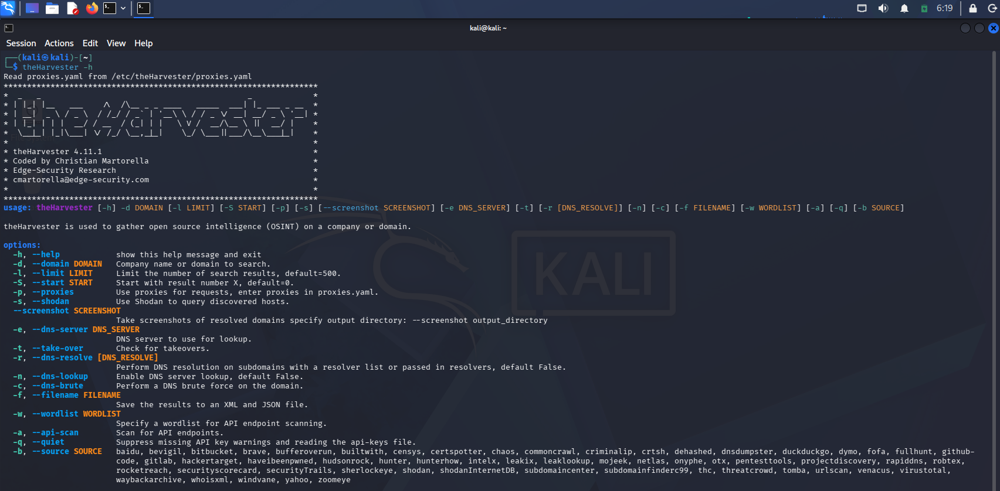
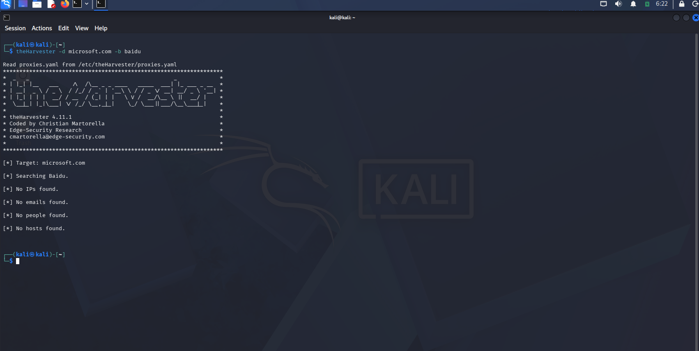
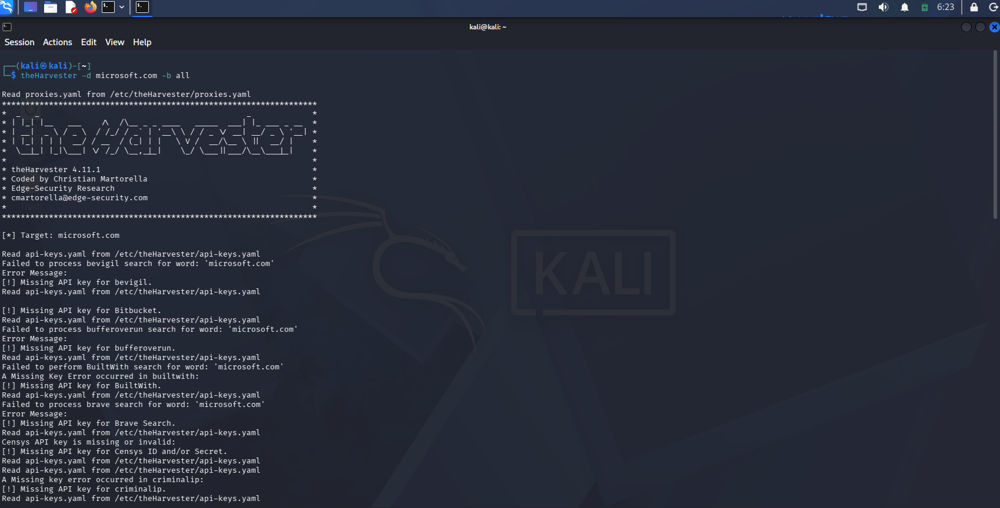

# 🔎 W2-PM4 — theHarvester OSINT Aggregation

**Networkwalks Cybersecurity Internship — Batch B083 | Week 2**

> **Phase 1: Reconnaissance & Footprinting**

---

# 📌 Project Overview

This module focuses on **Open-Source Intelligence (OSINT) aggregation** using **theHarvester**.

theHarvester is a reconnaissance tool used to collect publicly available information related to a target domain from search engines and other data sources.

For this activity, the target domain was:

```text
microsoft.com
```

The main focus was to identify publicly available information such as:

- Email addresses
- Subdomains
- Hostnames
- Publicly indexed information
- Available OSINT sources

---

# 🎯 Objectives

The objectives of this module were:

- Understand the concept of OSINT reconnaissance.
- Learn the basic usage of theHarvester.
- Gather publicly available information about a domain.
- Identify publicly indexed email addresses.
- Identify subdomains associated with the target.
- Understand the role of search engines in reconnaissance.
- Understand the limitations of OSINT tools when API keys are unavailable.

---

# 🛠️ Tool Used

## theHarvester

### Purpose

theHarvester is an OSINT reconnaissance tool that can collect publicly available information from different sources.

### Information Collected

The tool can be used to identify:

- Email addresses
- Subdomains
- Hosts
- IP addresses
- URLs
- Publicly indexed information

---

# 🎯 Target Information

### Target Domain

```text
microsoft.com
```

### Activity Type

```text
OSINT Reconnaissance
```

### Scope

The activity focused on publicly available information associated with the target domain.

---

# 🔬 Methodology

The following methodology was followed:

```text
Target Domain
      ↓
Launch theHarvester
      ↓
Select OSINT Source
      ↓
Collect Public Information
      ↓
Review Emails and Hosts
      ↓
Check Additional Sources
      ↓
Analyze Security Relevance
      ↓
Document Findings
```

---

# 💻 Activities Performed

## Activity 1 — theHarvester Help and Tool Understanding

### Objective

Understand the available options and data sources provided by theHarvester before performing the reconnaissance activity.

### Tool Used

```text
theHarvester
```

### Command

```bash
theHarvester -h
```

### Result

The help menu displayed the available options supported by theHarvester.

The output showed options for:

- Domain enumeration
- Selecting data sources
- Setting result limits
- DNS resolution
- DNS server selection
- API-based sources
- Screenshot options
- Proxy configuration

The help output also showed multiple supported OSINT sources.

### Security Relevance

Understanding the available options helps perform reconnaissance in a controlled and organized way.

### Screenshot Evidence



---

# 🔎 Activity 2 — OSINT Enumeration Using Baidu

### Objective

Collect publicly indexed information related to `microsoft.com` using a search engine source.

### Target

```text
microsoft.com
```

### Source

```text
Baidu
```

### Command

```bash
theHarvester -d microsoft.com -b baidu
```

### Result

TheHarvester successfully searched the target domain using Baidu.

The results displayed:

```text
Target: microsoft.com
Searching Baidu
```

The enumeration returned:

```text
Emails found: 1
Hosts found: 4
```

One email address identified during the activity was:

```text
viva.noreply@microsoft.com
```

Several hosts/subdomains were also identified, including:

```text
hxd.research.microsoft.com
schannels.microsoft.com
t.msn.microsoft.com
watson.microsoft.com
```

### Security Relevance

Publicly available email addresses and subdomains can provide useful information during the reconnaissance phase.

This information can help an attacker understand:

- The organization's external infrastructure.
- Publicly accessible resources.
- Possible attack-surface areas.
- Naming conventions used by the organization.

These findings are **reconnaissance observations and not confirmed vulnerabilities**.

### Screenshot Evidence



---

# 🌐 Activity 3 — Checking Multiple OSINT Sources

### Objective

Understand how theHarvester can use multiple OSINT sources and identify limitations when API keys are not configured.

### Command

```bash
theHarvester -d microsoft.com -b all
```

### Result

TheHarvester attempted to access multiple available data sources.

The output showed that several sources required API keys.

Examples shown in the output included:

```text
BeVigil
Bing
Bufferoverun
Crtsh
DNSDumpster
GitHub
Google
Hunter
Intelx
LinkedIn
Netcraft
SecurityTrails
Shodan
VirusTotal
Yahoo
```

The tool displayed messages indicating that API keys were missing for several sources.

### Security Relevance

Using multiple OSINT sources can provide broader reconnaissance coverage.

However, API-based sources may require separate API keys before information can be collected.

Therefore, the results from this activity should not be considered a complete representation of the target's publicly available information.

### Screenshot Evidence



---

# 📊 Findings Summary

| Finding | Observation | Security Relevance |
|---|---|---|
| Target Domain | `microsoft.com` | Target used for OSINT exercise |
| Email Address | `viva.noreply@microsoft.com` | Provides publicly indexed email information |
| Hosts | 4 hosts identified | Reveals additional domain infrastructure |
| Subdomain | `hxd.research.microsoft.com` | Publicly indexed subdomain |
| Subdomain | `schannels.microsoft.com` | Publicly indexed host |
| Subdomain | `t.msn.microsoft.com` | Publicly indexed host |
| Subdomain | `watson.microsoft.com` | Publicly indexed host |
| Search Source | Baidu | Provided publicly indexed information |
| API Sources | Several required API keys | Limited additional enumeration |

---

# ⚠️ API Key Limitations

During the multiple-source enumeration, theHarvester reported that several sources required API keys.

### Examples

```text
BeVigil
Bing
Bufferoverun
DNSDumpster
GitHub
Hunter
SecurityTrails
Shodan
VirusTotal
```

### Impact

Without the required API keys, information from those sources could not be fully retrieved.

This means the collected information represents only the data available through the accessible sources during the exercise.

---

# 🔐 Security Impact

The activity demonstrated how publicly available information can contribute to an organization's external attack-surface mapping.

### 1. Email Exposure

A publicly indexed email address was identified.

**Potential Risk:** Medium

Public email information may be useful for further reconnaissance or social-engineering research.

### 2. Subdomain Exposure

Multiple hosts and subdomains were identified.

**Potential Risk:** Medium

Subdomains can reveal additional infrastructure, applications, or services that may require further security assessment.

### 3. Public OSINT Information

Search engines and public data sources can expose useful information about organizations.

**Potential Risk:** Low to Medium

Attackers can combine information from multiple public sources to build a better understanding of an organization's infrastructure.

> These are security considerations based on reconnaissance observations and should not be interpreted as confirmed vulnerabilities.

---

# 🛡️ Recommendations

Organizations can reduce unnecessary OSINT exposure by:

- Regularly reviewing publicly exposed email addresses.
- Monitoring publicly indexed subdomains.
- Reviewing external DNS records.
- Removing unnecessary sensitive information from public sources.
- Monitoring search-engine indexing.
- Maintaining an inventory of external-facing assets.
- Reviewing third-party data exposure.
- Monitoring the organization's external attack surface.
- Avoiding unnecessary disclosure of internal infrastructure information.

---

# 🧠 Learning Outcomes

After completing this module, I learned:

- What OSINT reconnaissance means.
- How to use theHarvester.
- How to select OSINT data sources.
- How search engines can provide publicly available information.
- How to identify publicly indexed email addresses.
- How to identify hosts and subdomains.
- How multiple OSINT sources can improve reconnaissance.
- Why API keys are required for some data sources.
- How reconnaissance information can help with attack-surface mapping.
- How to document reconnaissance observations professionally.

---

# 🔄 Reconnaissance Workflow

```text
1. Identify Target
        ↓
2. Understand theHarvester Options
        ↓
3. Select Search Source
        ↓
4. Perform Domain Enumeration
        ↓
5. Identify Emails
        ↓
6. Identify Hosts/Subdomains
        ↓
7. Check Additional OSINT Sources
        ↓
8. Review API Limitations
        ↓
9. Analyze Security Relevance
        ↓
10. Document Findings
```

---

# 📸 Evidence & Screenshots

## Evidence 1 — theHarvester Help Menu

The screenshot demonstrates the available theHarvester options and supported reconnaissance sources.


---

## Evidence 2 — Baidu OSINT Enumeration

The screenshot demonstrates the successful enumeration of `microsoft.com` using Baidu and shows the discovered email address and hosts.


---

## Evidence 3 — Multiple OSINT Sources

The screenshot demonstrates theHarvester attempting to use multiple sources and displaying API-key requirements for several sources.


---

# 📁 Repository Structure

```text
W2 PM4 - theHarvester OSINT/
│
├── README.md
│
├── 01-theharvester-help.png
├── 02-theharvester-baidu-results.png
└── 03-theharvester-api-sources.png
```

---

# 📋 Module Summary

| Category | Details |
|---|---|
| Module | PM4 |
| Topic | theHarvester / OSINT Aggregation |
| Phase | Phase 1 — Reconnaissance & Footprinting |
| Target | `microsoft.com` |
| Tool | theHarvester |
| Search Source | Baidu |
| Emails Found | 1 |
| Hosts Found | 4 |
| API Sources | Multiple |
| API Limitation | API keys required for several sources |
| Primary Focus | Public OSINT Collection |

---

# ⚖️ Legal & Ethical Disclaimer

This activity was performed for **educational and authorized cybersecurity training purposes** as part of the Networkwalks Cybersecurity Internship.

Only domains and systems within the approved scope should be tested.

Do not use reconnaissance tools against systems without proper authorization.

The information presented in this report represents observations obtained during the exercise and should not be interpreted as confirmation of vulnerabilities.

---

# 📌 Project Information

**Program:** Networkwalks Cybersecurity Internship  
**Batch:** B083  
**Week:** 2  
**Module:** PM4  
**Phase:** Phase 1 — Reconnaissance & Footprinting  
**Activity:** theHarvester OSINT Aggregation

---

# 👨‍💻 Author

**Gopal Mahajan**

Cybersecurity Student | VAPT & SOC Enthusiast

---

# 🙏 Acknowledgement

I would like to thank **Networkwalks** for providing this practical cybersecurity internship and the opportunity to gain hands-on experience with reconnaissance, OSINT, and security assessment tools.

---

# ✅ Module Completion

**PM4 — theHarvester OSINT Aggregation: Completed ✅**
